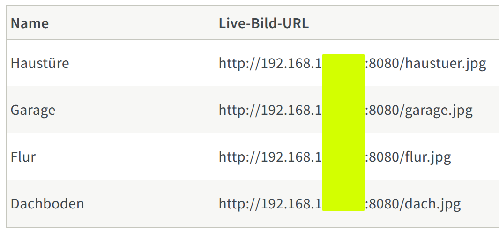

# rtsp2jpeg-http-get

> Serve a single JPEG snapshot of one or more RTSP(S) camera streams on HTTP GET – minimal, memory-efficient, and docker-ready.

## 🚀 Features

- On-demand snapshot of any RTSP or RTSPS stream
- HTTP GET returns a fresh `.jpg` each time
- No disk I/O (in-memory encoding with OpenCV)
- .env-based configuration or CLI override
- `uv`-friendly, Docker-ready, and installable as CLI tool
- Perfect for use with FritzBox, Home Assistant, and other snapshot-based systems

---

## 🛠️ Installation

### Using `uv` (recommended):

```bash
uv pip install -e .
```

## Configuration via .env file or environment variables

In Unifi Protect, you will find the URLs in the settings section of your video camera. You need to enable the low resolution stream for this to work and copy the address to your environment file as shown here.

```env
PORT=8080
#USE_FFMPEG=true
INVALID_CERT=true

SNAPSHOT_CAM1=/haustuer.jpg::rtsps://192.168.178.5:7441/someToken123?enableSrtp
SNAPSHOT_CAM2=/garage.jpg::rtsps://192.168.178.5:7441/someToken456?enableSrtp
SNAPSHOT_CAM3=/flur.jpg::rtsps://192.168.178.5:7441/someToken789?enableSrtp
SNAPSHOT_CAM4=/dach.jpg::192.168.178.5:7441/someTokenABC?enableSrtp
```

## Docker

```bash
docker build -t rtsp2jpeg .
docker run -p 8080:8080 --env-file .env rtsp2jpeg
# with auto-restarting in case of crash
docker run --restart unless-stopped -p 8080:8080 --env-file .env rtsp2jpeg
```

## Docker compose

```yaml
services:
  rtsp2jpeg:
    build: .
    ports:
      - "8080:8080"
    env_file:
      - .env
    restart: unless-stopped
```

## Usage

Simply add the URL of the given host and path(s) to your Fritz!Box in:

Telefonie -> Telefoniegeräte -> Live-Bild

Example:



And on your Phone, you will see:

